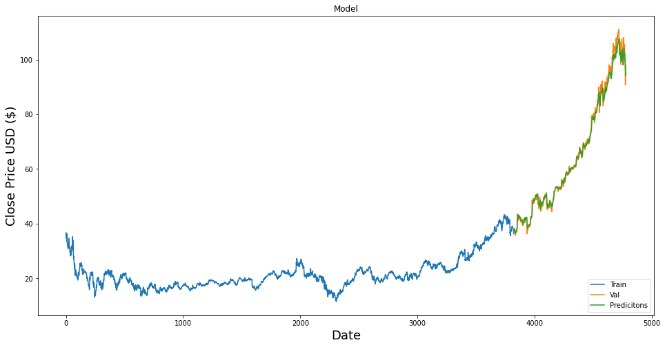

# Data Mining Stock

### Table of Contents

1. [Description](#description)
2. [Preview](#preview)
3. [Technologies](#technologies)

## Description

-LSTM Model

The model was built on MSFT stock closing data being
at the year 2000-01-01. 80% of the data was used to predict the
next 20%

To Build an LSTM models you need
-data set - Dataset is a 2d array [[60][60][60] … [60]]
-training set - is a 2d array [[60]]
The data set is use to
predict the training set. The model is trained until a loss
Limit is reached

-How to use the Models

The LSTM model can now be used to predict stock market closing prices based on
given data.

Restrictions:
- The given data must be in the same format as training data ie [[60] [60]....[60]]
- Has to be scaled between 1-0
- Data used has to be around the range of the training model The model will prediction a value based on the training based on MSFT

## Preview
The code can be found in the src/Demo1.ipynb. Their are also multiple variations on this code in the same folder.
This is a graph of the model accuracy.



```apple = yf.Ticker("AAPL")
df = apple.history(start ='2015-01-01', end = '2016-01-01')
new_df = df.filter(['Close'])
data = new_df[-60:].values

data_scaled = scaler.transform(data)
apple_60_predictions = []

for i in range(60):
    x_test = []
    x_test.append(data_scaled)
    x_test = np.array(x_test)
    x_test = np.reshape(x_test, (x_test.shape[0], x_test.shape[1], 1))

    pred_price = model.predict(x_test)
    data_scaled= np.concatenate((data_scaled[1:], [[pred_price[0][0]]]))
    pred_price = scaler.inverse_transform(pred_price)
    apple_60_predictions.append(pred_price[0][0])

df = apple.history(start ='2016-01-01')
print("Predictions" , "Actual")
for i in range(60):
    print(apple_60_predictions[i],"    ", df['Close'][i])
```
This create a prediction of 60 days for apple stock with the above give model.


## Technologies

- Machine learning with tensorflow 
- Data manipulation with scaler tranforming and compression, with matplotlib and numpy
- Various data gathering with api's calls using yfinance 
